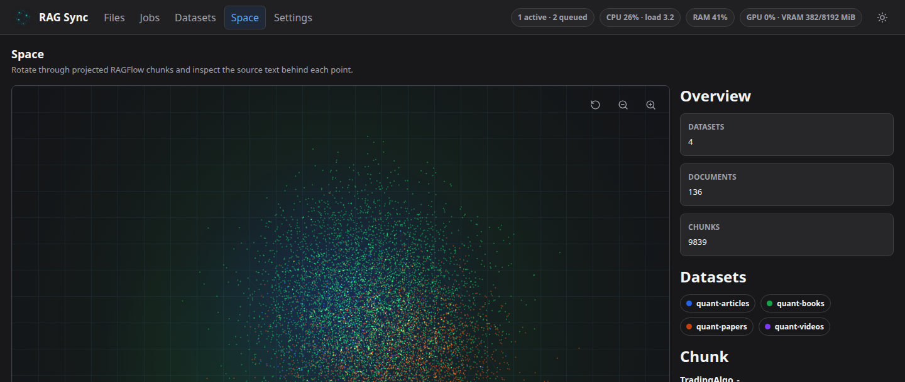

# RAG Sync

RAG Sync is a small local app for keeping source documents in sync with RAGFlow.

It watches your folders, turns files into Markdown when needed, uploads them, and shows what is happening along the way. Nothing fancy. Just the bits I kept wanting while dealing with lots of PDFs, parser runs, queues, and RAGFlow datasets.

The web UI gives you the practical stuff: files, jobs, datasets, parser status, and a rough "space" view of chunks so you can see how the corpus is spread out.

## What It Does

- Scans folders from `config/profiles.toml`
- Converts PDFs and Markdown with Marker, MinerU, GLM-OCR, or passthrough mode
- Uploads documents to RAGFlow datasets
- Tracks jobs and document state in SQLite
- Shows progress in a local web UI
- Keeps generated files under `data/`

It does not edit your source files.

## Setup

You need Python 3.12+, `uv`, Node.js 20+, and a running RAGFlow instance.

```bash
uv sync --dev
npm install
npm --prefix web install
```

Then edit `config/profiles.toml` so the source paths and dataset names match your setup.

Set your RAGFlow connection:

```bash
export RAGFLOW_BASE_URL="http://127.0.0.1:9380"
export RAGFLOW_API_KEY="your-ragflow-api-key"
```

Optional parser paths:

```bash
export RAG_SYNC_MARKER_BIN="/path/to/marker"
export RAG_SYNC_MINERU_BIN="/path/to/mineru"
```

For GLM-OCR, set one of these:

```bash
export Z_AI_API_KEY="your-key"
```

## Run It

Backend:

```bash
uv run uvicorn rag_sync.api:app --host 0.0.0.0 --port 8091
```

Frontend:

```bash
npm --prefix web run dev -- --port 5174
```

CLI:

```bash
uv run rag-sync --help
```

## Tests

```bash
uv run pytest
npm --prefix web test
npm --prefix web run build
```

## License

MIT
